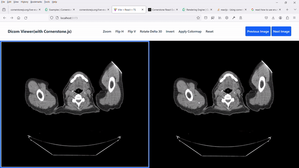
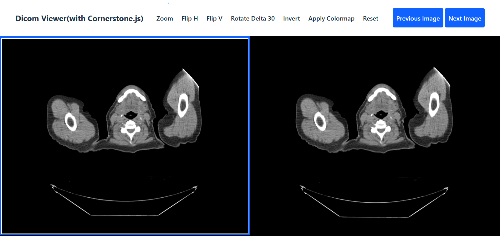
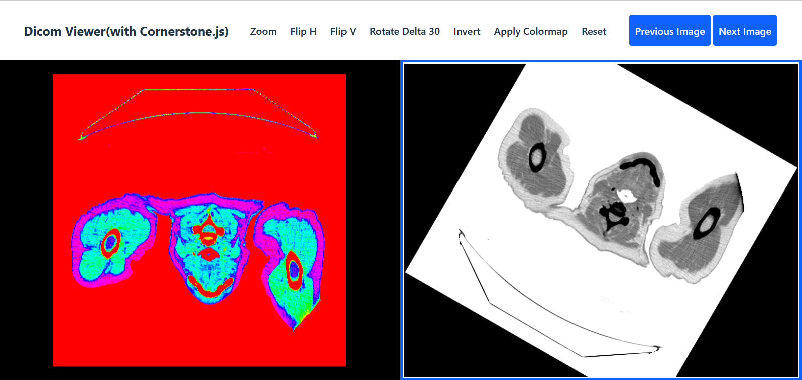

# DICOM image visualization

이것은 다양한 이미지 조작 기능이 장착된 DICOM 이미지 시각화 뷰어입니다. 사용자는 이미지 뷰포트를 선택하고 이러한 뷰포트 내의 이미지 사이를 매끄럽게 이동하며 줌, 뒤집기, 회전, 색상 반전, 컬러맵 적용 및 이미지를 기본 상태로 재설정하는 등 다양한 조작을 수행할 수 있습니다.

Netlify에서 애플리케이션을 보려면 클릭하세요: 👉 [DICOM images viewer](https://dicom-explorer.netlify.app/)

## 프로젝트를 다운로드합니다

이 저장소를 포크하고 클론합니다

## 프로젝트를 로컬에서 실행합니다

```sh
npm install
npm run dev
```

## DICOM 이미지 시각화 뷰어 작동 중인 스크린샷



<br>
<br>





## 의존성

- Node 18.x or above
- NPM 9.x or above
- react 18.2.0
- @cornerstonejs/core 1.66.7
- @cornerstonejs/tools 0.20.11
- @kitware/vtk.js 24.18.7
- cornerstone-wado-image-loader 4.1.3
- dicom-parser 1.8.13
- gl-matrix 3.4.3
- husky 9.x or above
- lint-staged 15.x or above
- eslint 8.x or above
- prettier 3.x or above
- typescript 5.x or above
- tailwindcss 3.x or above
